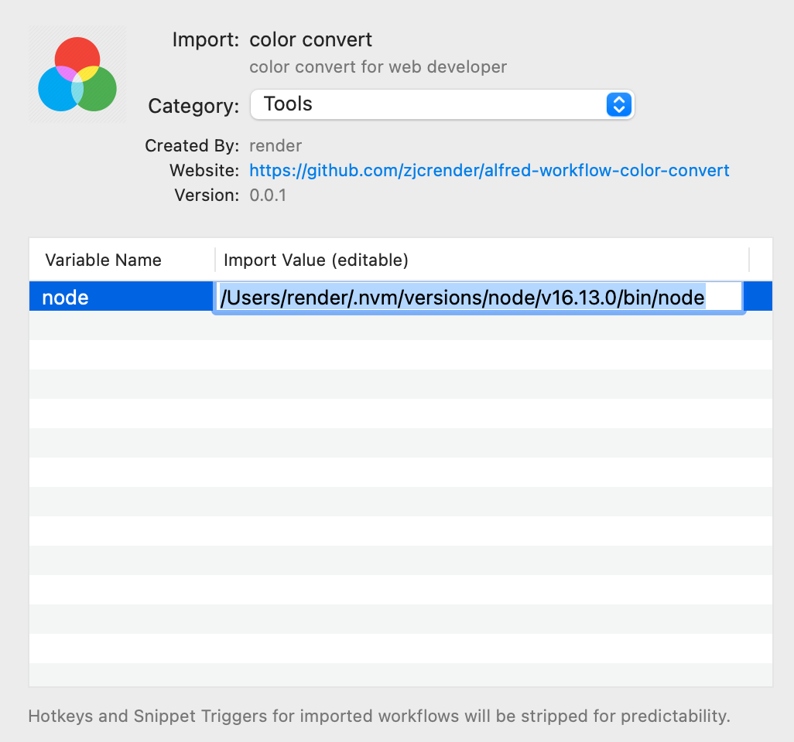

# Alfred workflow color convert
将颜色转换为CSS颜色

### 安装
#### 1. 获取`node`环境变量
```shell
$ which node
# 如: /Users/<userName>/.nvm/versions/node/v16.13.0/bin/node
```
#### 2. 将工作流的环境变量node设置为上述获得的值


### 使用
